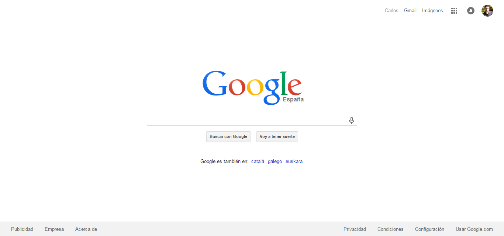

# google-homepage
Rebuilding of Google.es homepage using HTML5 and CSS3.

This is an assignment part of the curriculum of [The Odin Project](http://www.theodinproject.com/). 

The webpage was built based on spanish version of Google, with my account loged in. See below the screenshot of the original page used to recreate it.

